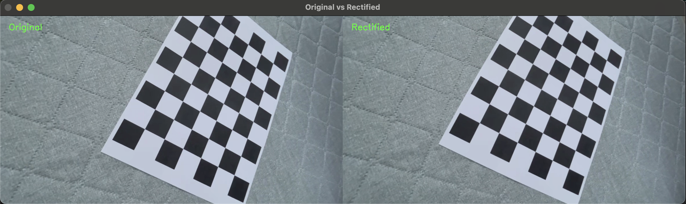

# 📷 Camera Calibration and Lens Distortion Correction

## 🔍 프로그램 소개

이 프로그램은 OpenCV를 활용해 **카메라 캘리브레이션(Camera Calibration)** 및 **렌즈 왜곡 보정(Lens Distortion Correction)** 기능을 수행합니다. 체스보드 패턴을 다양한 각도에서 촬영한 영상을 바탕으로, 내부 파라미터(camera matrix) 및 렌즈 왜곡 계수(distortion coefficients)를 계산하고, 이를 통해 왜곡 없는 영상으로 보정합니다.

## ✨ 주요 기능

-  체스보드 영상을 이용한 **카메라 캘리브레이션**
-  내부 파라미터(`fx`, `fy`, `cx`, `cy`) 및 왜곡 계수 추정
-  보정된 영상 출력 및 **왜곡 전후 비교**
-  `.npy` 파일로 결과 저장 및 활용 가능

## 📐 Camera Calibration 결과

- **Camera Matrix (K):**
  `[603.84531917 0. 636.77983071] [ 0. 604.51866139 369.04824641] [ 0. 0. 1. ]`
  
- **초점 거리**
`fx`: 603.85
`fy`: 604.52

- **주점 좌표 (이미지 중심)**
`cx`: 636.78
`cy`: 369.05

- **Distortion Coefficients :**
  `[0.0144577, 0.00562268, 0.01222251, 0.00160317, -0.19529929]`

- **RMS Error :**  `0.49387225828860176`

## 🧪 사용한 체스보드 정보

- **내부 코너 개수:** 8 x 6  
- **셀 크기:** 30mm  
- **용지:** A4 출력

## ✅ original vs rectified

